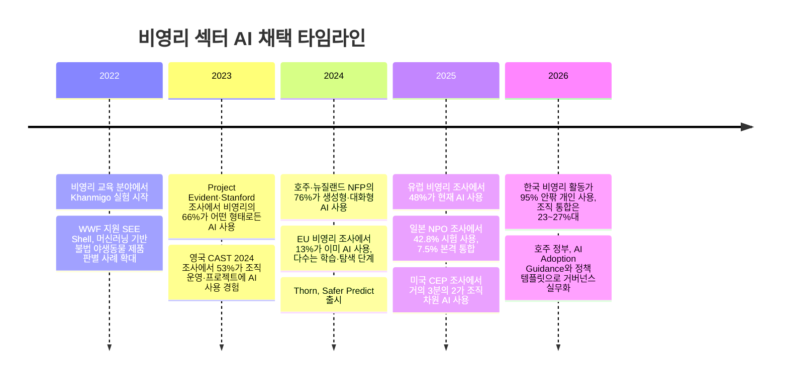
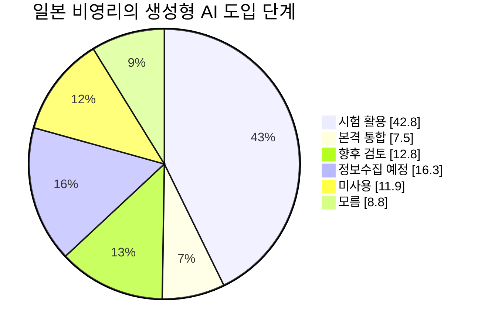
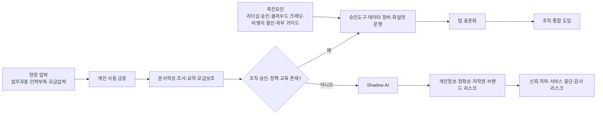

# 2026년 비영리 조직의 AI 활용 수준 분석 보고서

## Executive Summary

2026년 현재 비영리 조직의 AI 활용은 “도입 여부”를 넘어 “누가, 어떤 통제 아래, 어느 업무에, 어느 정도 깊이로 쓰는가”의 문제로 옮겨갔다. 다만 국가별 격차보다 더 크게 드러나는 것은 **개인 사용과 조직 통합의 격차**, 그리고 **소규모 조직과 대형 조직의 격차**다. 한국에서는 개인 차원의 AI 사용이 이미 92.7~95% 수준까지 올라왔지만, 조직 차원의 공식 도입은 23~27% 수준에 머물고, 명확한 가이드라인을 가진 조직은 약 10%에 그친다. 일본은 “시험 사용”이 42.8%로 넓게 퍼졌지만 “업무에 본격 통합”은 7.5%에 불과하다. 반면 미국과 유럽은 조직 차원의 활용이 더 진전되어, 미국 비영리·재단 표본에서는 거의 3분의 2가 AI를 사용한다고 답했고, 유럽 비영리 2025 조사에서는 48%가 현재 AI를 사용한다고 답했다. 호주는 현장 도구 사용이 빠르게 늘었지만 정책과 통제가 뒤처진 전형적 사례로, 76%가 생성형·대화형 AI를 사용한다는 응답과 함께 89%가 아직 AI 정책·프레임워크를 두지 않았다고 답했다. citeturn20view0turn20view2turn13view1turn15view1turn9view0turn7view0

활용 영역은 거의 모든 국가에서 비슷하다. 가장 먼저 확산된 것은 문서 초안 작성, 요약, 조사 정리, 커뮤니케이션, 내부 생산성 개선, 기금모금 보조다. 한국 응답자들은 문서·보고서 작성, 자료 조사·정리, 기획·아이디어 발상, 데이터 정리·분석에 AI를 가장 많이 사용했다. 미국 비영리·재단 조사에서도 커뮤니케이션, 내부 생산성, 개발·모금이 가장 흔한 용도였다. 유럽과 영국에서도 마케팅·커뮤니케이션, 내부 효율화, 프로그램·임팩트 보고, 디지털 모금이 핵심 활용처로 나타났다. 즉, **고위험 의사결정 자동화보다 저위험 지식노동 보조가 주류**이며, 대다수 비영리 조직은 아직 맞춤형 모델보다 범용 생성형 AI와 SaaS 내장 AI를 먼저 활용하고 있다. citeturn20view0turn15view1turn23view0turn22view0turn37view4

문제는 기술보다 거버넌스다. 한국은 개인 구독이 49%에 달해 “조직 승인 없는 AI 사용”이 구조화되고 있고, 영국 CAST 조사에서도 42%가 개인 AI 계정을 업무에 쓴다고 답했다. 호주에서는 89%가 아직 AI 정책을 운영하지 않고, 일본은 IT 인력의 수와 스킬이 둘 다 약 90% 부족하다고 답했다. 유럽은 개인정보보호와 데이터 보안을 각각 49%, 47%가 최대 우려로 지목했고, 미국·유럽의 다수 조사도 정확성, 편향, 내부 전문성 부족을 공통 리스크로 꼽는다. 따라서 2026년 비영리 AI의 본질은 “도구 확산”이 아니라 **거버넌스 후행**이다. citeturn20view0turn38view0turn7view0turn13view1turn9view0turn15view1turn22view0

향후 3년은 **조직 표준화의 시기**, 5년은 **데이터 거버넌스가 있는 조직과 없는 조직의 격차가 구조화되는 시기**가 될 가능성이 높다. 한국의 AI 기본법은 2026년부터 시행되고, 개인정보보호위원회는 2025년 생성형 AI 개인정보 처리 안내서를 내놓았으며, EU AI Act는 2024년 발효 후 단계적으로 적용되고 있다. 일본은 2026년판 AI Guidelines for Business를, 호주는 2025년 이후 Guidance for AI Adoption과 AI 정책 템플릿을 내놓았다. 미국은 강제적 단일 연방 AI법보다 NIST AI RMF와 GenAI Profile 같은 준거 프레임을 중심으로 움직이고 있다. 이 흐름은 비영리에게 “AI를 쓸 것인가”보다 “어떤 리스크 분류와 통제 체계로 쓸 것인가”를 묻는다. 이는 보고서의 핵심 결론이기도 하다. citeturn30search3turn34search1turn30search4turn30search8turn30search12turn30search17turn31search5turn31search6turn31search9turn32search0turn32search5

## 연구 범위와 해석 프레임

이 보고서는 2022~2026년의 최신 설문, 보고서, 정부·규제 가이드, 학술·실무 자료를 바탕으로 한국과 미국·영국·EU·일본·호주의 비영리 조직 AI 활용 수준을 비교했다. 다만 조사마다 표본이 다르다. 어떤 조사는 “직원이 AI를 써본 적이 있는가”를 묻고, 다른 조사는 “조직이 공식적으로 AI를 도입했는가”를 묻는다. 또 디지털 친화 표본과 전체 등록단체 표본의 수치 차이도 크다. 따라서 본 보고서는 단일 수치보다 **개인 사용률**, **조직 차원의 공식 도입**, **전사적 통합 수준**, **정책·인력·데이터 기반**을 나눠 해석한다. citeturn15view2turn12view0turn38view0turn9view0turn26view0

실무적으로는 다음 세 가지 레벨을 구분하는 것이 가장 유용하다. 첫째, **도구 사용 단계**는 직원이 ChatGPT, Copilot, Gemini 같은 범용 도구를 개인 또는 팀 수준에서 쓰는 상태다. 둘째, **조직 도입 단계**는 조직이 공식 계정, 승인 도구, 교육, 파일럿 프로젝트를 운영하는 상태다. 셋째, **통합 운영 단계**는 데이터 거버넌스, 리스크 관리, 예산, 책임자, 정책, 성과지표를 갖춘 상태다. 한국·영국·호주에서 가장 두드러지는 사실은 첫째와 둘째 사이의 간극이며, 일본에서는 둘째와 셋째 사이의 간극이 크다. 미국과 유럽은 셋째 단계로 일부 이동 중이지만, 여전히 대부분은 커뮤니케이션·모금·운영 보조 중심이다. citeturn20view0turn38view0turn7view0turn13view1turn15view1turn9view0

## 국가별, 규모별, 분야별 비교

### 국가별 비교표

| 국가 | 개인·직원 사용 신호 | 조직 도입·통합 신호 | 주요 활용 영역 | 거버넌스·인력 이슈 | 종합 판정 |
|---|---|---|---|---|---|
| 한국 | 개인 사용 92.7%, 주 2~3회 이상 77.8%, 거의 매일 약 50% 수준. citeturn20view0turn20view2 | 조직 차원 공식 도입 26.8%, 자율·통합 사용 약 23%, 가이드라인 보유 약 10%. citeturn20view0turn20view2 | 문서·보고서, 조사·정리, 기획, 데이터 분석, 홍보 콘텐츠. citeturn20view0 | 61.9%가 AI 제도 미비, 개인 구독 49%. citeturn20view0 | **개인주도·Shadow AI형** |
| 미국 | 조직 사용은 조사에 따라 “약 2/3”에서 70% 안팎, Salesforce 미국 스냅샷은 71% AI users로 제시. citeturn15view1turn23view1 | 거의 3분의 2가 조직 사용, 38%는 3개 이상 use case 보유. citeturn15view1turn22view0 | 커뮤니케이션 84%, 내부 생산성 63%, 개발·모금 61%, 프로그램 설계·서비스·임팩트 보고 확장. citeturn15view1turn22view0 | 예산·자원 부족이 주요 장벽이며, 재단의 비금전·재정 지원은 여전히 부족. citeturn22view0turn15view1 | **통합 전환 선도형** |
| 영국 | 2025 Charity Digital 표본에서는 76% 사용, CAST 2026 고디지털 표본에선 89% 개인 사용. citeturn11search10turn38view0 | 보수적 전체표본인 Charity Commission 2024에선 전체 3%, £100k~500k 5%, £500k 이상 6%, 세부적으로 £1m 이상 8%. 한편 CAST 2026에선 조직 사용 92%. citeturn12view0turn38view0 | 마케팅·커뮤니케이션, 글쓰기, 내부 효율화, 평가·서비스·기금모금. citeturn23view0turn38view0 | 47%가 조직 지원이 거의 없다고 답했고, 52%만 AI 정책 보유. 38%가 개인정보·GDPR·보안을 최대 장벽으로 지목. citeturn38view0 | **격차 확대형** |
| EU | 2025 유럽 비영리 조사에서 48% 사용, 56%는 도입에 열려 있음. 2024 조사에서는 13%가 이미 사용 중인 초기단계였다. citeturn9view0turn8view1 | 2024→2025 사이 도입이 급증했으나, 여전히 “학습 필요”와 “조심스러운 낙관”이 다수. citeturn8view0turn9view0 | 디지털 모금, 마케팅, 임팩트 보고, 운영 효율화. citeturn9view0turn8view2 | 데이터 프라이버시 49%, 데이터 보안 47%가 핵심 우려. citeturn9view0 | **정책·프라이버시 민감형** |
| 일본 | 생성AI “시험 사용” 42.8%, 비사용 11.9%, 향후 정보수집 예정 16.3%. citeturn13view1turn28view3 | “업무에 본격 통합”은 7.5%, 향후 활용 의향은 76.9%. citeturn28view0 | 업무 효율화, 아이디어 창출, 홍보 강화, 웹 개선, 온라인 세미나 운영. citeturn13view1turn26view0 | IT 인력 수·스킬 모두 약 90% 부족. 생성AI 우려는 정확성 65.6%, 기술 이해 52.8%, 노하우 부족 52.5%. citeturn28view0turn37view2 | **실험 확대·통합 미약형** |
| 호주 | 2024 호주·뉴질랜드 NFP에서 생성형·대화형 AI 사용 76%. 2025 Salesforce 호주 스냅샷 AI user 44%. citeturn7view0turn22view1 | 조직 전체에서 AI를 탐색·투자 중인 곳은 32%, 정책·가이드라인 미보유 89%. citeturn7view0turn37view4 | 글쓰기, 프로그램 설계, 서비스 전달, 데이터 인사이트. citeturn22view1turn37view4 | “우선순위 아님” 42%, 데이터 보안·주권·프라이버시 우려 13%, 할인·숙련 인력 부족. citeturn7view0 | **도구 급확산·정책 후행형** |

이 표가 보여주는 핵심은 한국과 호주가 “현장 도구 사용은 빠르지만 제도화가 늦은” 유형이고, 일본은 “관심과 실험은 많지만 본격 통합이 느린” 유형이며, 미국·EU는 “조직 활용이 앞서가지만 데이터·윤리·자금 문제가 병목”인 유형이라는 점이다. 영국은 특히 소규모 자선단체와 디지털 선도 자선단체 사이의 편차가 가장 크다. citeturn20view0turn7view0turn28view0turn15view1turn9view0turn12view0turn38view0

### 규모별 비교표

| 규모 | 전형적 도입 패턴 | 대표 근거 | 시사점 |
|---|---|---|---|
| 소규모 | 개인 계정 기반의 글쓰기·조사·요약 중심. 공식 정책과 교육이 약하고, AI readiness는 조직이 첫 기술·MERL 인력을 채용하는 시점 전후에 크게 달라진다. citeturn16view1 | Salesforce에선 소규모 조직 AI 사용 28%, 개방성 40%. 영국 보수표본에선 £10k 미만 2%, £10k~£100k 3%. citeturn22view0turn12view0 | “도구 보급”보다 **승인도구·기본정책·공동학습**이 먼저다. |
| 중간 | 팀 단위 라이선스, 기금모금·커뮤니케이션 자동화, CRM·워크플로우, 파일럿 프로젝트가 늘어남. citeturn22view0turn15view1 | CAST 2026 응답자의 다수가 중대형 조직이고, 조직 활용은 92%이나 지원 부족이 병존. citeturn38view0 | “개인 활용”을 “부서 프로세스”로 전환할 최적 구간이다. |
| 대형 | 전사 파일럿, 승인 계정, 데이터 보호 조치, 프로그램 설계·서비스·임팩트 보고로 확장. 예측분석·맞춤형 챗봇 도입 가능성도 가장 높음. citeturn22view0turn23view1 | 100+ 직원 조직은 AI 사용 66%, 개방성 65%. TechSoup 벤치마크에서도 대형 조직이 생성AI·챗봇·예측분석 사용자 비중의 약 64~68%를 차지. citeturn22view0turn36view3 | ROI보다 **리스크 분류·감사 가능성·모델 공급망 관리**가 핵심이 된다. |

결국 규모 효과는 단순한 “예산 차이”가 아니라 **전담 인력, 데이터 정비, 승인 도구, 교육 체계**의 존재 여부에서 나온다. GivingTuesday 조사에서 AI readiness의 가장 강한 예측변수는 일반적 조직역량이 아니라 기술 또는 MERL 인력을 채용했는지 여부였고, 첫 채용 전환점은 대략 15명 내외의 직원 규모에서 관찰됐다. citeturn16view1

### 분야별 비교표

| 분야 | 현재 성숙도 | 정량·정성 근거 | 해석 |
|---|---|---|---|
| 교육 | 높음 | 교육 분야 비영리 응답자는 다른 분야보다 AI 사용이 유의하게 높았고, Project Evident 조사에서 전통적 AI 사용 “예” 60.0%, 생성AI 사용 “예” 66.0%로 기타 분야보다 높았다. Khan Academy는 비영리 교육기관으로 Khanmigo를 안전 설계와 감독 하에 운영한다. citeturn36view1turn39search3turn39search10turn39search12 | 데이터 축적과 반복적 지식업무 덕분에 확산이 빠르다. |
| 국제구호·구난 | 높음 | Salesforce 조사에서 Rescue 81%, International Aid 77%. CARE는 위기대응 준비도 분석과 교육 프로그램 트래킹 도구에 AI를 적용했다. citeturn37view0turn41search4turn41search2 | 현장 수요 예측·준비도 분석·보고 자동화 수요가 강하다. |
| 환경 | 높음 | Salesforce 조사에서 Environment 77%. WWF가 지원한 SEE Shell은 머신러닝·이미지 인식을 활용해 불법 거래 감지에 적용됐다. citeturn37view0turn41search5 | 이미지·센서·공간데이터 활용이 많아 AI 적합성이 높다. |
| 문화·예술 | 중상 | Salesforce 조사에서 Arts & Culture 79%. citeturn37view0 | 커뮤니케이션·후원자 경험·콘텐츠 제작에서 빠르게 쓰이지만, 맞춤형 모델 필요성은 상대적으로 낮다. |
| 사회복지·보건 | 중간 | Crisis Text Line은 ML/AI로 대화 triage와 자원 관리, 훈련 시뮬레이션을 수행한다. 반면 NEDA의 Tessa는 유해한 조언을 제공해 중단됐다. citeturn39search2turn42news18turn41search1 | 영향받는 대상이 취약할수록 “효율”보다 안전·정확성·인간 개입 기준이 더 엄격해야 한다. |
| 인권·정책옹호 | 중간 | Amnesty는 알고리즘 책임성 툴킷과 디지털 포렌식 툴을 통해 AI 감시·권리침해를 조사하고 대응한다. citeturn39search0turn39search13turn39search17 | 이 분야는 서비스 자동화보다 **감시, 증거수집, 책임성 감시**에서 AI 활용이 강하다. |

직접 비교 가능한 분야별 국가 통계는 아직 부족하지만, **교육·환경·국제구호**는 데이터와 반복업무가 많아 빠르게 확산되고, **사회복지·보건·인권**은 민감정보와 취약집단을 다루기 때문에 안전성 기준이 훨씬 높다는 방향성은 매우 일관되다. citeturn36view1turn37view0turn39search2turn42news18

위 타임라인은 2022~2026년 사이 비영리 AI가 단순한 관심에서 파일럿, 그리고 일부 국가의 조직 차원 표준화 단계로 이동했음을 보여준다. 그러나 대부분의 조직은 아직 **기본 자동화·생성형 AI**에 머물러 있으며, 맞춤형 모델이나 고위험 대민서비스 자동화는 예외적이다. citeturn39search6turn41search5turn18view0turn38view1turn7view0turn8view1turn40search0turn9view0turn28view3turn15view1turn20view2turn31search6

## 활용 영역, 기술 수준, 데이터 인프라와 인력 역량

2026년 비영리 AI의 기술 수준은 대체로 **기본 자동화 → 대화형 AI·생성AI → 내장형 AI → 제한적 예측분석/맞춤형 모델**의 순서로 확산되어 있다. 한국에서는 가장 흔한 활용이 문서 작성, 조사, 아이디어 발상, 데이터 정리로 나타났고, 미국·유럽에서도 커뮤니케이션과 내부 생산성, 모금 지원이 최상위였다. 호주·뉴질랜드 조사에서는 AI 내장 제품 사용이 “1 in 5”, 맞춤형 AI 앱 개발은 3%에 불과했고, 데이터 분석·인사이트를 위한 AI/ML 도입은 21%가 “향후 고려” 수준이었다. 일본도 “본격 통합” 7.5%, “시험 사용” 42.8%로, 아직은 **탐색적·보조적 기술 채택**이 중심이다. citeturn20view0turn15view1turn9view0turn7view0turn28view3

데이터 인프라는 AI 성숙도를 가르는 가장 중요한 하부 조건이다. 유럽·미국 조사들은 디지털 성숙도와 통합 데이터가 AI readiness를 좌우한다고 반복적으로 지적한다. Salesforce는 디지털 성숙도가 낮은 조직일수록 낡은 CRM과 사일로 데이터를 먼저 해결해야 한다고 권고했고, GivingTuesday는 현장의 가장 큰 미충족 AI 수요가 “데이터 자동 정리”라고 봤다. 유럽과 호주 조사에서 데이터 프라이버시·보안이 최상위 우려였고, 호주는 2025~2026년 정부 가이드를 통해 책임소재, 이해관계자 영향평가, 리스크 관리, 테스트, 투명성, 사람·정책 역량을 기본 프레임으로 제시했다. 즉, 비영리의 AI 문제는 모델 성능보다 **데이터 정합성과 데이터 통제 가능성**의 문제에 가깝다. citeturn22view0turn16view3turn9view0turn31search6turn31search9

인력 역량은 거의 모든 지역에서 제약이다. 일본은 IT 인력 수·스킬이 모두 약 90% 부족했고, 영국 CAST 2026에서는 47%가 조직의 AI 지원이 거의 없다고 답했으며, 섹터 전체 지원이 충분하다고 본 비율은 18%에 불과했다. 한국은 개인이 먼저 비용을 부담하며 사용하고 있고, GivingTuesday는 기술 또는 MERL 인력의 존재가 AI readiness를 설명하는 가장 강한 변수라고 분석했다. 이는 비영리 조직이 단순한 “전문가 1명 채용”을 넘어 **업무담당자+데이터담당자+정책담당자**의 교차 기능을 만들어야 함을 뜻한다. citeturn28view0turn38view0turn20view0turn16view1

예산 측면에서도 패턴은 명확하다. Salesforce 조사에서 비영리의 약 4분의 1은 예산·자원 부족을 AI 도입 상위 장벽으로 꼽았고, Infoxchange는 AI 제품 할인 부족과 숙련 인력 부족을 동시에 지적했다. CEP는 재단들이 여전히 수혜 단체의 AI 도입에 대해 충분한 자금·비금전 지원을 제공하지 않는다고 봤다. 다만 동시에 공급 측면에서는 공식 지원수단도 늘고 있다. Google은 2025년부터 Google for Nonprofits에 10개 이상의 무상 AI 기능을 추가하고 국가 지원을 확대했으며, Google Workspace for Nonprofits는 최대 2,000명까지 무상 플랜과 AI 기능을 제공한다. AWS는 비영리 크레딧 프로그램을 통해 최대 5,000달러의 크레딧을 제공하고, Microsoft는 비영리용 오퍼와 AI 거버넌스 프레임워크를 마련했다. 따라서 문제는 “돈이 전혀 없어서”라기보다는, **승인된 투자 설계와 조직 내 우선순위 설정이 부재해서** 생기는 경우가 많다. citeturn22view0turn7view0turn15view1turn29search9turn29search13turn29search3turn29search16turn43search3

이 파이차트는 일본 NPO센터 조사 기준이지만, 2026년 비영리 AI의 전형적 성숙도 분포를 매우 잘 보여준다. 즉, 많은 조직이 이미 기술을 접했지만, **시험 활용에서 통합 운영으로 넘어가는 비율은 아직 낮다**는 점이다. 한국과 호주 역시 이와 유사한 구조를 보이며, 한국은 특히 개인 사용이 조직화보다 더 앞서 있다. citeturn28view3turn20view0turn7view0

## 장벽, 촉진요인, 성공 사례와 실패 사례

가장 큰 장벽은 네 가지다. 첫째, 데이터 프라이버시·보안·정확성이다. 유럽, 일본, 영국, 미국 조사 모두 이 항목을 최상위 또는 공동 최상위 장벽으로 제시했다. 둘째, 내부 역량 부족이다. 일본의 기술 이해·노하우 부족, 영국의 교육 부족, 미국의 내부 전문성 부족이 이를 뒷받침한다. 셋째, 예산과 자원의 제약이다. 넷째, “어디서부터 시작해야 할지 모름”이다. 반대로 촉진요인은 명확하다. 리더십 승인, 승인도구 제공, 데이터 정비, 부서별 우선 use case 선정, 외부 할인·크레딧·프로보노 지원, 그리고 책임 있는 정책 프레임의 조기 도입이다. citeturn9view0turn37view2turn38view0turn22view0turn7view0turn29search3turn29search13turn43search0

이 흐름도는 한국의 개인 선행 사용, 영국의 shadow AI, 일본의 정확성·기술이해 우려, 호주의 정책 부재, 미국·유럽의 데이터 리스크 공통 우려를 종합한 것이다. 운영상 핵심 포인트는 간단하다. **개인 사용을 방치하면 risk가 되고, 승인된 팀 사용으로 끌어올리면 asset가 된다.** citeturn20view0turn38view0turn37view2turn7view0turn22view0turn9view0

성공 사례는 이미 다양하다. Khan Academy는 비영리 교육기관으로서 Khanmigo를 AI 튜터·교사용 보조도구로 운영하면서, 안전장치와 책임 있는 AI 개발 원칙을 공개했다. Thorn는 비영리이면서 직접 ML/AI 안전 솔루션을 만들어 아동 성착취물과 AI 생성 유해물 대응에 활용하고 있다. CARE는 재난 대비도 분석과 교육 프로그램 추적에 AI를 도입했고, Crisis Text Line은 기계학습과 AI로 상담 대화 triage, 자원 공유, 자원봉사자 훈련 시뮬레이션을 수행한다. 이 네 사례는 모두 “인간을 완전히 대체”하지 않고, **전문가 판단을 보조하거나 우선순위를 정리하는 방식**을 채택했다는 공통점이 있다. citeturn39search3turn39search10turn39search12turn40search0turn40search5turn40search9turn41search4turn41search2turn39search2

실패 사례는 더 중요한 교훈을 준다. NEDA의 Tessa 챗봇은 원래 예방용 자원으로 설계되었지만, 2023년 유해한 식이·체중감량 조언을 제공해 운영이 중단됐다. 이 사건은 취약집단 대상의 보건·상담 영역에서 생성형 또는 대화형 AI를 “비용 절감형 대체재”로 투입할 때 어떤 문제가 발생하는지 보여준다. 정확성과 안전성, 인간 개입, 이상 응답 탐지, 위기 escalation 경로가 없으면 AI는 효율을 주기보다 위험을 증폭할 수 있다. 사회복지·정신건강·인권 분야가 다른 분야보다 더 보수적인 도입 전략을 가져야 하는 이유가 여기에 있다. citeturn42news18turn41search1

## 전망, 권고안, 단계별 실행 로드맵

향후 3년을 보면, 거의 모든 국가에서 **백오피스와 모금·커뮤니케이션 영역의 AI는 표준 도구화**될 가능성이 높다. 유럽은 이미 48% 사용 단계에 들어왔고, 일본은 76.9%가 향후 활용 의향을 보였으며, 한국은 개인 사용이 임계점을 넘었다. 동시에 각국 정부와 규제기관은 “투명성, 데이터 보호, 책임 주체, 영향평가”에 관한 실무 지침을 잇달아 내놓고 있다. 따라서 2029년까지의 승부처는 더 좋은 모델을 찾는 것이 아니라, **조직 내부에서 AI를 승인·감사·학습 가능한 운영 시스템으로 만드는 것**이다. 이 전망은 여러 조사 추세를 바탕으로 한 분석적 추론이다. citeturn9view0turn28view0turn20view2turn30search3turn34search1turn30search4turn31search6turn32search5

5년 관점에서는 격차가 더 구조화될 가능성이 크다. 첫 번째 그룹은 데이터 전략, 승인 도구, 교육, 예산, 책임자 체계를 만든 “AI-enabled nonprofits”이고, 두 번째 그룹은 개인적 사용과 단기 효율에 머무는 “AI-fragmented nonprofits”다. Project Evident의 ‘opportunity gap’, CEP의 수혜단체 지원 부족 지적, GivingTuesday의 인력 전환점 분석은 모두 이 격차가 기술보다 **조직역량과 자금조달 구조**에 의해 결정될 것임을 시사한다. citeturn18view0turn15view1turn16view1

### 기술·정책·운영 권고안

| 우선순위 | 권고안 | 왜 지금 필요한가 |
|---|---|---|
| 최상 | **전사 AI 사용정책과 승인도구 목록을 90일 내 제정** | 한국은 가이드라인 보유 10% 수준, 호주는 89%가 정책 미비, 영국도 shadow AI가 확산 중이다. citeturn20view0turn7view0turn38view0 |
| 최상 | **고위험/저위험 use case를 분리하고, 대민 서비스는 human-in-the-loop 원칙 적용** | NEDA 사례와 각국 가이드는 취약집단 대상 AI의 위험을 반복적으로 보여준다. citeturn42news18turn31search6turn33search8turn34search1 |
| 상 | **문서·조사·보고·모금 콘텐츠부터 시작하고, 상담·자격판정·민감한 추천은 후순위** | 현존 조사의 주류 use case가 이 영역에 집중돼 있고 위험도도 상대적으로 낮다. citeturn20view0turn15view1turn9view0 |
| 상 | **데이터 정비와 CRM/문서 저장 구조를 AI 투자보다 먼저 점검** | 통합 데이터와 디지털 성숙도가 AI readiness를 좌우한다. citeturn22view0turn16view3turn43search13 |
| 상 | **조직당 최소 1명의 AI 운영책임자와 1명의 데이터 보호 책임 연결선 지정** | 호주·미국·한국·EU 가이드는 모두 책임성과 데이터 보호를 핵심 규범으로 제시한다. citeturn31search6turn32search5turn34search1turn30search4 |
| 중 | **비영리 할인·크레딧·프로보노를 조달 전략에 포함** | Google, AWS, Microsoft가 공식 프로그램을 운영 중이다. citeturn29search13turn29search3turn29search16 |
| 중 | **모금 분야는 Fundraising.AI 프레임워크를 기준으로 신뢰보호 설계** | 기부자 신뢰 손상은 비영리에게 가장 큰 장기비용이다. citeturn43search0turn43search17 |

### 단계별 실행 로드맵

아래 예산은 **실무 추정치**다. 조직별 도구 선택, 내부 인건비, 컨설팅 수준에 따라 달라질 수 있으며, Google·AWS·Microsoft의 비영리 무상/할인 프로그램 활용을 전제로 한 범위다. citeturn29search13turn29search3turn29search16

| 단계 | 기간 | 핵심 과업 | 책임자 유형 | 예산 추정 |
|---|---|---|---|---|
| 준비 | 0~3개월 | AI 인벤토리 작성, 승인도구 목록, 금지 데이터 정의, 파일럿 2~3개 선정, 기본 교육 | 사무총장/COO, 개인정보보호책임자, IT/디지털 리드 | 소형 500만~1,500만원 / 중형 1,500만~5,000만원 / 대형 5,000만~1.5억원 |
| 파일럿 | 3~9개월 | 문서·조사·모금·보고 자동화 파일럿, 프롬프트 표준, human review 절차, KPI 설정 | 부서장, 데이터 담당, 현업 챔피언 | 소형 1,000만~3,000만원 / 중형 3,000만~8,000만원 / 대형 8,000만~3억원 |
| 표준화 | 9~18개월 | 정책 정식화, 로그·감사, 벤더 DPA, 교육체계, 승인 워크플로우, 대시보드 | COO, 법무·컴플라이언스, CDO/데이터 스튜어드 | 소형 2,000만~4,000만원 / 중형 8,000만~2억원 / 대형 2억~5억원 |
| 통합 | 18~36개월 | CRM·지식관리·프로그램 관리와 통합, 제한적 예측분석, 대민서비스 safety review | CEO, 이사회 위험위원회, 프로그램 총괄 | 소형 3,000만~8,000만원 / 중형 1억~3억원 / 대형 3억~10억원+ |

작은 조직은 “비싼 AI”보다 **정책 1장, 승인도구 2개, 교육 3회, 파일럿 2개**가 훨씬 중요하다. 중간 조직은 팀 단위 표준화를, 대형 조직은 데이터 파이프라인과 감사를 중심으로 접근해야 한다. 가장 비용 효율적인 순서는 **쓰기/요약 → 보고/모금 → 검색/지식관리 → 분석/예측 → 대민 서비스**다. citeturn20view0turn15view1turn22view0turn31search6

## 리스크 매트릭스, 한계, 출처 우선순위, 슬라이드 핵심 포인트

### 리스크 매트릭스

| 리스크 | 발생 가능성 | 영향도 | 조기 경보 신호 | 핵심 통제 | 근거 |
|---|---|---|---|---|---|
| 개인정보·민감정보 유출 | 높음 | 매우 높음 | 개인 계정 사용, 미승인 프롬프트 업로드 | 승인도구, 데이터 등급표, 비식별화, DPA | citeturn34search1turn33search8turn31search6 |
| 환각·부정확 응답 | 높음 | 높음 | 검수시간 증가, 반대되는 답변 반복 | human review, 근거기반 검색, 테스트 세트 | citeturn37view2turn9view0turn32search5 |
| 편향·차별·배제 | 중~높음 | 매우 높음 | 특정 집단 불이익, 불만 증가 | 영향평가, stakeholder review, contestability | citeturn31search6turn30search4turn39search0 |
| Shadow AI와 정책 불이행 | 높음 | 높음 | 개인 구독 급증, 부서별 다른 도구 사용 | 승인목록, 계정 통합, 교육, 로그감사 | citeturn20view0turn38view0 |
| 저작권·출처·콘텐츠 신뢰 훼손 | 중간 | 높음 | 생성 이미지·텍스트 출처 불명, 대외 커뮤니케이션 논란 | 출처표시, 라벨링, 리뷰, 금지 사용영역 명시 | citeturn34search5turn31search11turn43search0 |
| 대민서비스 안전사고 | 중간 | 매우 높음 | 유해 응답, escalation 실패, 현장 불만 | 인간 개입, 고위험 use case 제한, 중단 기준 | citeturn42news18turn31search6turn34search1 |
| 미션 드리프트와 기부자 신뢰 훼손 | 중간 | 높음 | “효율만” 강조, 내부 반발, 대외 신뢰 저하 | 이사회 검토, 투명성, 미션 적합성 기준 | citeturn43search0turn33search1turn15view1 |

### 한계와 미해결 질문

첫째, 국가별 “도입률”은 조사 정의가 달라 완전히 같은 숫자로 비교할 수 없다. 둘째, 일본과 한국은 개인 사용과 조직 통합을 동시에 측정한 고품질 패널이 아직 제한적이다. 셋째, 인권·보건·사회복지 분야는 정량 지표보다 고위험 사례와 실무 가이드가 더 많아, 분야 비교에서 일부는 정성평가 비중이 높다. 넷째, 2026년 현재 정책 환경은 빠르게 변하고 있어, 특히 한국 AI 기본법 하위지침, 호주 AI Adoption Guidance, 일본 가이드라인 개정은 후속 업데이트를 계속 점검해야 한다. citeturn20view0turn20view2turn26view0turn31search6turn30search17turn34search5

### 데이터·사례 출처 우선순위 목록

이 보고서의 핵심 출처는 다음 우선순위로 정리할 수 있다.

| 우선순위 | 출처군 | 대표 자료 |
|---|---|---|
| 최우선 | 정부·규제·공식 가이드 | 한국 MSIT AI 기본법 자료, PIPC 생성형 AI 개인정보 안내서, EU AI Act 공식 페이지, UK ICO·Charity Commission, Japan AI Guidelines for Business, Australia Guidance for AI Adoption, NIST AI RMF/GenAI Profile. citeturn30search3turn34search1turn30search4turn33search1turn33search8turn30search17turn31search6turn32search5 |
| 상 | 비영리 섹터 설문·연합 보고서 | 다음세대재단/홍익지능 2026, 아름다운재단 2026, Japan NPO Center 2025, Infoxchange 2024, European Nonprofit Pulse 2025, CEP 2025, Project Evident·Stanford 2024, Charity Digital Skills 2025, CAST 2026. citeturn20view2turn20view0turn26view0turn7view0turn10search0turn15view1turn18view0turn11search10turn38view0 |
| 중 | 실무 프레임워크·연구 인프라 | Fundraising.AI Framework, Microsoft AI Governance Framework for Nonprofits, GivingTuesday AI Readiness Survey. citeturn43search0turn43search3turn15view2 |
| 보강 | 구체 사례와 실패 사례 | Khan Academy, Thorn, CARE, Crisis Text Line, NEDA Tessa 중단 사례. citeturn39search10turn40search0turn41search4turn39search2turn42news18 |

### 요약 슬라이드용 핵심 포인트

- 한국 비영리의 AI는 이미 **개인 사용률 93~95% 수준**이지만, **조직 차원의 공식 도입은 23~27%**로 뒤처져 있다. citeturn20view0turn20view2
- 미국과 EU는 조직 활용이 더 앞서 있으며, 미국은 조사에 따라 **약 2/3 이상**, 유럽은 **48% 사용** 단계다. citeturn15view1turn9view0
- 일본은 **시험 사용 42.8%**, **본격 통합 7.5%**로 “실험은 넓고 통합은 얕은” 구조다. citeturn28view3
- 호주는 **생성형 AI 사용 76%**로 빠르게 확산됐지만, **89%가 정책 부재** 상태다. citeturn7view0
- 비영리 AI의 현재 주류는 **문서작성·조사·요약·커뮤니케이션·모금 보조**이며, 고위험 자동화는 아직 예외적이다. citeturn20view0turn15view1turn9view0
- **소규모 조직의 병목은 모델 성능이 아니라 승인도구, 교육, 데이터 정비, 책임자 부재**다. citeturn16view1turn22view0
- 교육·국제구호·환경 분야는 상대적으로 빠르게 확산되고, 사회복지·보건·인권은 안전성 기준이 더 엄격하다. citeturn36view1turn37view0turn39search2turn42news18
- 실패 사례는 “챗봇 대체”가 아니라 **인간전문가 보조와 안전한 escalation 설계**가 중요함을 보여준다. citeturn42news18turn39search2
- 향후 3년의 핵심 과제는 **AI 도입 자체가 아니라 정책·데이터·책임성의 표준화**다. citeturn30search4turn34search1turn31search6turn32search5
- 가장 효과적인 시작점은 **전사 정책 1개, 승인도구 목록, 저위험 파일럿 2~3개, 교육 체계, 데이터 보호 기준**을 동시에 만드는 것이다. citeturn43search3turn43search0turn31search9