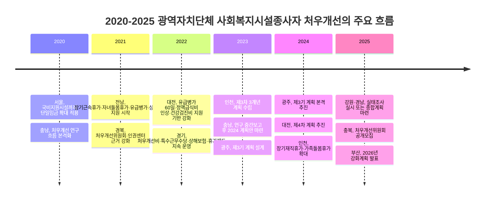

# 광역자치단체별 사회복지시설종사자 처우개선 현황 비교 보고서

## Executive summary

2025년 기준 광역자치단체의 사회복지시설종사자 처우개선은 크게 세 갈래로 나뉜다. 서울·인천·광주처럼 광역단위에서 단일임금 또는 복지부 가이드라인 상향 적용을 명시한 지역, 경기·충남·전남·대전처럼 수당·휴가·보험·대체인력을 패키지로 확대한 지역, 강원·충북·전북·제주처럼 조례와 실태조사 체계는 갖췄지만 공개 자료에서 금액형 지원 내역이 제한적인 지역이 그것이다.

전국 공통의 기본선은 보건복지부의 2025년 사회복지시설 종사자 인건비 가이드라인이며, 2025년 최저임금은 시급 10,030원, 월 환산 2,096,270원이다. 다만 실제 광역비교에서는 ‘광역 자체 호봉표·단일임금’보다 ‘복지부 가이드라인 준용 + 지방수당·휴가·복지포인트’ 방식이 더 일반적이어서, 기본임금 항목은 공개 자료에 따라 상향률·준용 여부·광역 자체체계 유무 중심으로 정리하는 것이 가장 정확하다.

비교 결과, 가장 적극적인 처우개선은 서울의 단일임금 체계, 인천의 복지부 기준 101% 지급, 광주의 전체시설 가이드라인 확대 적용, 경기의 광범위한 정액수당·휴가 패키지, 충남의 정액급식비·안전체계·대체인력 결합형 지원에서 확인된다. 반면 부산·세종·강원·충북·전북·제주 등은 조례나 계획 수립 근거는 있으나, 2025년 광역차원의 세부 금액표 공개 수준은 상대적으로 낮았다.

## 조사 범위와 판정 기준

본 보고서는 17개 광역자치단체를 대상으로, 2020년부터 2025년까지의 공개 문서를 우선 수집해 비교했다. 우선순위는 지자체 공식 사이트, 지방의회 조례·예산서·업무보고, 보건복지부 및 고용노동부 자료, 그다음으로 사회복지사협회·사회서비스원 등 준공공 자료, 마지막으로 언론 순으로 잡았다. 공식 자료에서 확인되지 않는 항목은 “자료 없음”으로 표기했고, 공식 자료가 존재하되 세부 금액만 보조자료에서 확인되는 경우에는 별도 주석으로 표시했다.

기본임금 비교는 다음 원칙을 적용했다. 첫째, 별도 광역 단일임금 또는 상향비율이 있는 경우 그 수치를 우선 기술했다. 둘째, 광역단위 월급표가 공개되지 않은 경우에는 “보건복지부 2025 인건비 가이드라인 준용” 여부를 적었다. 셋째, 수당·휴가·보험·교육비는 **금액/일수/지원내용이 명시된 경우만** 적었고, 문구만 확인되는 경우는 제도 존재 여부만 기록했다. 이 때문에 아래 표는 “모든 지역의 동일 형식 숫자 비교표”라기보다, 공개 가능한 수준에서 가장 신뢰도 높은 **광역단위 처우개선 비교표**로 읽는 것이 적절하다.

## 시도별 비교표

| 시·도 | 기본임금 기준 | 주요 수당 | 근로조건 | 복리후생·교육 | 조례·예산·주요 변경 | 적용 대상·시행 | 출처 |
| --- | --- | --- | --- | --- | --- | --- | --- |
| 서울 | 서울형 단일임금 체계. 서울시는 2023년 발표에서 2022년 복지부 권고안 대비 108.2% 수준 지급을 설명했고, 2025년 계획(보조자료 기준)은 기본급 2.5% 인상으로 안내됨. | 정액급식비 월 12만 원, 가족수당 배우자 4만 원·기타 2만 원·자녀 3/7/11만 원(보조자료). | 자녀돌봄휴가 요건 완화, 병가·장기근속휴가·배우자출산휴가 확대. | 심리치료 지원 확대, 대체인력 지원, 단체연수 지원. | 2020년부터 국비지원시설까지 서울 단일임금 확대 적용. 2025년 처우개선 및 운영계획 존재 확인. | 서울시 사회복지시설 종사자 전반. 2025 계획은 1월 시행 문서 존재. | 서울시 보도·정보소통광장·서울시사회복지사협회 공지. |
| 부산 | 2025년 사회복지법인·시설 업무가이드 공개. 광역단위 별도 상향비율·통합 월급표는 공개 검색 범위에서 확인하지 못함. | 2025 광역단위 공통 수당 금액 자료 없음. | 2025 공개자료만으로는 공통 휴가·병가 제도 세부 확인 어려움. | 광역 공통 복리후생 금액 자료 없음. | 2025.10 발표한 2026 강화계획에서 재가노인서비스센터 호봉제 도입, 2025 예산심사에서도 처우개선 예산이 “대폭 확대”되었다는 설명이 확인됨. | 사회복지법인·시설 전반, 특히 재가노인서비스센터 제도개선이 2026 반영 예정. | 부산시 복지정책과 자료실, 부산시 보도자료, 부산시의회 회의록. |
| 대구 | 공개 검색 범위에서 광역단위 통합 급여표·상향비율 자료 없음. 시설별로 복지부 가이드라인 또는 개별 지침 적용으로 보임. | 광역단위 공통 수당 금액 자료 없음. | 2025 업무보고·정책자료에서 대체인력 파견 운영과 국고지원시설 적용범위 확대 논의가 확인됨. | 광역 공통 복리후생 금액 자료 없음. | 2025년 업무보고·정책자료 기준 처우개선 사업 지속 추진 확인. 다만 세부 금액 자료 공개도는 낮음. | 사회복지시설 종사자 전반. | 대구시의회·정책자료. |
| 인천 | 2025년부터 사회복지시설 하위직 종사자 인건비를 복지부 가이드라인 대비 101%까지 인상한다고 시가 발표. | 복지포인트 50포인트 인상, 종사자 교육비 100% 인상, 해외연수 추진. | 국가사회복지시설에도 가족돌봄휴가 적용, 장기재직휴가 확대, 동일 법인 전입 경력 인정. | 복지포인트, 교육비 확대, 해외연수. | 제3차 3개년(2024~2026) 추진계획에 따라 2024년부터 단계 시행. | 사회복지시설 종사자 전반, 특히 하위직·국가사회복지시설 포함 확대. | 인천시 보도자료·정책자료. |
| 광주 | 보건복지부 인건비 가이드라인을 전체 시설로 확대 적용. 아동공동생활가정·지역아동센터 등도 호봉제 전환 추진. | 복지포인트 2025~2026년 매년 50P(1P=1천 원) 인상. | 건강검진휴가제 도입, 가족돌봄휴가 대상을 자녀에서 노부모까지 확대, 장기재직휴가 기준 5년 이상으로 확대, 유급병가 사업 확대. | 1년 이상 근무 종사자 대상 종합건강검진비 지원, 정신건강 지원. | 제3기 처우개선계획(2024~2026) 본격 시행. 2025년 세부 건강검진 운영기준 별도 공지. | 사회복지시설 종사자 전반. | 광주복지플랫폼(공식) 카드뉴스·계획서·운영기준. |
| 대전 | 대전형 임금체계 구축을 추진해 왔고, 2025년 실태조사 보도자료도 이를 핵심 성과로 재확인. | 정액급식비 인상(3만 원→5만 원) 확인. | 유급병가 제도 도입 및 60일 범위 운영, 장기근속휴가제도. | 종합건강검진비 지원, 건강검진 휴가. | 2022년 조사 결과를 바탕으로 제4차 계획 추진, 2025년 제5차 실태조사 착수. | 대전시 사회복지시설 종사자 전반. | 대전시 보도자료·대전시의회 자료. |
| 울산 | 광역 공통 급여표·상향비율 자료 없음. | 2025 예산서상 보호시설 종사자 처우개선수당 47,520천 원, 사회복지사 자격수당 10,560천 원, 야간근무수당 26,400천 원, 상담소 종사자 처우개선 58,800천 원. | 사회복지시설 종사자 대체인력지원 예산 편성 확인. | 광역 공통 건강검진·보험 등 세부 자료 없음. | 시 조직상 복지정책과의 소관업무로 “사회복지시설 종사자 권익보호 및 처우개선”이 명시되어 있으며, 2025 정책실명 과제와 예산서에서 사업 존재 확인. | 전반적 제도는 지역 전체, 금액 공개는 보호시설·상담소 등 일부 영역 중심. | 울산시 조직업무·예산서·정책실명제. |
| 세종 | 광역단위 별도 월급표·상향비율 자료 없음. 다만 2025 연구자료에서 2021~2023 처우개선 3개년 계획 내 ‘임금체계 개선 사업’ 존재가 확인됨. | 공개 검색 범위에서 금액 자료 없음. | 2025 행감에서 시가 처우개선비·후생복리 확대 노력을 지속 중이라고 설명. | 2025 조례 개정으로 권익지원센터 설치·운영 근거 강화. | 2021~2023 계획 이후, 2025년 실태조사·처우개선 방안 연구가 수행되어 2027~2029 종합계획의 기반으로 활용 중. | 세종시 내 사회복지법인·시설·관련 기관 종사자. | 세종시의회 조례안 심사보고·세종시사회서비스원 연구·행감회의록. |
| 경기 | 광역 별도 호봉표보다는 복지부 가이드라인 + 도 자체 정액수당 구조. | 처우개선비 월 5만 원/인, 특수근무수당 월 5만~29만 원/인, 특수지근무수당 월 10만 원/인, 보수교육비 연 5.6만 원/인, 상해보험비 연 1만 원/인. | 장기근속휴가 5~10일, 유급병가 연 60일, 대체인력 지원. 도청 페이지는 자녀돌봄휴가 연 2일로 안내하나, 2025 배포지침에서는 연 3일 확대가 확인됨. | 인권보호(법률·노무·심리), 상해보험, 교육·연수. | 2025 배포지침에서 장기근속휴가의 국비시설 확대 시행 확인. | 사회복지시설 및 사회복지사업 수행기관 종사자 등. | 경기도청 공식 안내·경기도사회복지사협회 2025 지침 공유. |
| 강원 | 조례는 사회복지사 등의 보수가 사회복지전담공무원 수준에 도달하도록 노력해야 한다고 규정. 2025년 공개 급여표는 확인하지 못함. | 조례 개정으로 “복지수당지원”을 “처우개선비 지원”으로 변경해 대상 확대 방향 제시. 세부 금액 자료는 공개 검색 범위에서 없음. | 2025년에 제4차 처우실태조사 실시. | 2025 공개자료에서 광역 공통 복리후생 금액 미확인. | 2025 조례 개정 및 2025 실태조사 실시가 핵심. 본격 종합계획은 2026년 이후 첫 수립. | 사회복지기관 종사자 전반. | 강원특별자치도 조례·도의회 입법예고·실태조사 공지. |
| 충북 | 광역단위 별도 급여표 자료 없음. | 광역 공통 수당 금액 자료 없음. | 사회복지시설 종사자 대체인력지원 예산 반영 확인. | 2025 주민참여예산에 ‘사회복지시설 종사자 힐링타임 운영’ 150백만 원 반영. 장기요양요원 지원센터 예산도 2025 확보. | 2025년 처우개선위원회 위원 공개모집 공고. | 사회복지시설 종사자 전반, 별도로 장기요양요원 지원 확대. | 충북도청 공고·예산서·보도자료. |
| 충남 | 적정 인건비 기준을 단계적으로 마련하는 정책을 2022~2026 공약사업으로 추진. | 정액급식비 5만 원→7만 원 확대. 2025 예산 기준 사회복지사 보수교육비 44,800천 원, 안전체계 구축 55,000천 원, 상담인력 46,000천 원, 대체인력 자체지원 100,000천 원+국비사업 569,520천 원. | 자녀돌봄휴가, 장기근속휴가, 상해보험료 지원, 대체인력 추가 도비지원이 연구·회의록에서 확인. | 위기대응교육, 법률·노무·심리지원, 역량강화 교육, 힐링캠프. | 2023 연구 중간보고 → 2024 계획 수립, 2022~2026 공약으로 지속. | 사회복지시설 종사자 및 협회 사업 대상자. | 충남도 공약자료·도의회 조례안/검토보고·보도자료. |
| 전북 | 공개 검색 범위에서 광역단위 별도 급여표·상향률·처우개선 계획 세부자료를 확인하지 못함. | 자료 없음. | 자료 없음. | 자료 없음. | 전북특별자치도 사회복지사 등의 처우 및 지위 향상을 위한 조례 존재는 확인됨. 다만 2025년 광역단위 금액형 지원 공개자료는 찾지 못함. | 전북특별자치도 사회복지사 등. | ELIS 자치법규정보시스템. |
| 전남 | 광역단위 별도 월급표 자료는 확인하지 못했으나, 2021년부터 처우개선 용역을 바탕으로 제도 시행 중. | 공개 검색 범위에서 광역 공통 정액수당 금액 자료 없음. | 2021년부터 장기근속휴가, 자녀돌봄휴가, 유급병가 지원. | 상해보험료 지원. | 2025 보도자료에서 2021년부터 다양한 복지혜택을 시행 중이라고 재확인. | 전남 지역 사회복지사·시설 종사자 전반. | 전남도 보도자료. |
| 경북 | 광역단위 별도 급여표 자료 없음. | 2025 예산서상 사회복지시설 종사자수당 255,024천 원, 사회복지시설 종사자 복지포인트 지원 22,770천 원, 노인복지시설 종사자수당 4,923,912천 원, 노인복지시설 종사자 복지포인트 지원 439,905천 원. | 세부 휴가·병가 공통기준은 공개 확인 어려움. | 복지포인트 지원. *주: 2026 정책안내에서 복지포인트를 연 15만→20만 원으로 인상한다고 밝혀 2025 기준은 연 15만 원으로 해석될 여지가 있으나, 이는 2026 문서를 통한 역산이므로 별도 확인이 필요함.* | 2021 조례 개정으로 처우개선위원회와 사회복지인 인권센터 근거 강화. 2025 예산심사에서 종사자 수당 대폭 증액 강조. | 사회복지시설 및 노인복지시설 종사자. | 경북도 예산서·도의회 보도자료·2026 변경정책 안내. |
| 경남 | 광역단위 공통 임금체계보다 ‘도 자체 처우개선비’가 핵심 쟁점. | 도 자체 지원으로 가계보조수당 월 20만 원, 명절격려수당 연 20만 원이 확인됨. | 2025년 5월 처우개선 종합계획 수립. 세부 휴가제도는 공개 검색 범위에서 일괄 확인 어려움. | 종합계획 수립 후 제도 점검·관리 단계. | 2024 실태조사 완료, 2025년 5월 종합계획 마련. 도의회는 가이드라인 준수율·도 자체 처우개선비를 핵심 쟁점으로 공개 논의. | 국가·지자체 운영비/인건비를 지원받는 시설의 정규직(월 20일 이상, 1일 8시간 이상 근무) 중심. | 경상남도의회 보도자료·회의록. |
| 제주 | 광역단위 급여표·상향률 자료 없음. | 자료 없음. | 조례 관련 문서에서 3년마다 보수 수준·지급실태 조사 규정이 확인됨. 대체인력지원 사업 존재는 별도 자료에서 확인. | 공개 검색 범위에서 광역 공통 복리후생 금액 자료 없음. | 제주특별자치도 사회복지사 등의 처우 및 지위 향상을 위한 조례는 2023년 개정본 확인. | 제주특별자치도 사회복지사 등, 대체인력지원 사업 포함. | ELIS 자치법규정보시스템·조례 관련 첨부문서·대체인력지원 관련 자료. |

표 주.

* **자료 없음**은 2026-05-29 기준 공개 접근 가능한 광역단위 공식자료 및 보조자료 검색 범위에서 확인되지 않았다는 뜻이다.
* 다수 지역은 **광역단위 자체 월급표를 공개하지 않고** 복지부 가이드라인 준용 + 지방수당을 운영하므로, 기본임금 칸은 “실액”보다 “기준체계”를 우선 표기했다.
* **보조자료 사용**: 서울 2025 세부 수당은 서울시사회복지사협회 게시 자료를 보조적으로 사용했다. 공식 서울시 문서에서는 계획 존재와 확대 방향은 확인되나, 검색 가능한 공개화면에서 세부 금액표까지는 일괄 확인되지 않았다.

전국 기준 출처: 고용노동부 2025 최저임금, 보건복지부 2025 인건비 가이드라인 안내.

## 주요 차이점

첫째, **기본임금 체계의 적극성 차이**가 크다. 서울은 단일임금 체계를 이미 장기간 운영해 왔고, 인천은 복지부 가이드라인 101% 적용을 공식화했으며, 광주는 복지부 인건비 가이드라인을 전체 시설로 확대했다. 반면 다수 도 단위 광역자치단체는 기본급 자체보다 수당·휴가·보험에 방점을 찍는 구조다.

둘째, **현금성 수당의 설계 방식**이 다르다. 경기도는 처우개선비·특수근무수당·특수지수당·보수교육비·상해보험비를 정액으로 조합해 제도화했고, 경남은 도 자체 수당으로 월 20만 원의 가계보조수당과 연 20만 원의 명절격려수당을 운영한다. 경북은 복지포인트와 시설종사자수당을 예산 항목으로 분리해 편성하는 방식이 두드러진다.

셋째, **휴가·병가의 질적 격차**가 크다. 경기의 유급병가 60일, 장기근속휴가 5~10일, 자녀돌봄휴가 확대와 대전의 유급병가 60일, 건강검진휴가, 광주의 건강검진휴가·가족돌봄휴가 확대는 복리후생의 질적 수준을 끌어올린 사례다. 전남도 2021년부터 장기근속휴가·자녀돌봄휴가·유급병가를 운영 중이다.

넷째, **대체인력과 안전·권익 지원의 결합 정도**가 다르다. 충남은 대체인력, 안전체계 구축, 법률·노무·심리지원을 하나의 패키지 사업으로 편성했고, 경기는 인권보호 지원을 명시적으로 운영한다. 반면 울산·충북·세종·강원 등은 대체인력 또는 조사·위원회 체계는 공개되지만, 그 위에 얹히는 정액형 권익·복지 패키지의 공개도는 상대적으로 낮다.

다섯째, **공개투명성 격차**도 정책 차이만큼 크다. 서울·인천·광주·경기·충남·대전은 광역단위 계획이나 사업 안내 문서에서 비교적 구체적인 항목을 확인할 수 있었지만, 전북·제주·강원·충북 일부 영역은 조례·위원회·실태조사 수준의 공개가 중심이어서 같은 항목의 정량 비교가 어렵다. 이는 실제 정책 격차이기도 하지만, 동시에 문서 공개 방식의 격차이기도 하다.

## 2020년부터 2025년까지 변화 타임라인

위 타임라인은 서울의 단일임금 확대, 전남의 2021년 복지혜택 시행, 경북의 2021년 조례 개정, 대전의 2022년 조사 기반 제도화, 인천·광주·충남의 2023~2025 계획 수립, 강원·경남·충북·부산의 2025년 조사·위원회·차기 계획 발표를 재구성한 것이다.

## 정책적 시사점

* **광역단위 ‘기본급 표준화’와 ‘수당 패키지’를 분리해 설계할 필요가 있다.** 서울·인천·광주처럼 기본임금 체계 정렬을 먼저 하고, 경기·충남처럼 수당·보험·휴가를 후속 패키지로 얹는 방식이 현장 체감도가 높다.
* **현금성 수당만으로는 이직·소진 문제를 해결하기 어렵다.** 경기·대전·광주·전남 사례처럼 유급병가, 장기근속휴가, 가족돌봄휴가, 건강검진휴가를 함께 설계해야 실질적인 처우개선이 된다.
* **대체인력과 권익보호를 묶은 통합 모델이 필요하다.** 충남은 대체인력과 함께 심리·법률·노무 지원까지 연결하고 있고, 경기는 인권보호 지원을 제도화하고 있다. 향후 다른 지자체도 단순 결원 대체가 아니라 ‘안전·회복·법률지원’까지 결합할 필요가 있다.
* **공개 문서 체계를 표준화해야 한다.** 조례만 있고 시행계획이나 예산 산출내역이 분절적으로 공개되는 지역은 비교 가능성이 떨어진다. 광역단위 처우개선 비교를 가능하게 하려면 매년 ‘기본급 기준·수당표·휴가·보험·적용대상·예산 규모’를 한 문서에 공개하는 형식이 필요하다.
* **시설유형별 사각지대 해소가 다음 과제다.** 광주의 지역아동센터·아동공동생활가정 호봉제 전환, 부산의 재가노인서비스센터 호봉제 도입, 경북의 노인복지시설 별도 수당·복지포인트는 모두 ‘특정 시설유형의 처우 격차’를 줄이려는 시도다. 앞으로는 노인·장애인·아동·가족센터·비법정시설 간 격차을 광역단위에서 더 명확히 관리해야 한다.

## 한계와 주석

이번 비교의 가장 큰 한계는, 광역자치단체가 실제로는 많은 지원을 하더라도 이를 **광역단위 통합 문서로 일괄 공개하지 않는 경우**가 많다는 점이다. 특히 전북·제주·강원·충북·세종 일부 영역은 조례와 조사 체계는 확인되지만, 2025년 기준의 월급표·수당표·휴가표가 공개 웹 문서에서 곧바로 확인되지 않았다. 이들 지역의 “자료 없음”은 정책 부재를 뜻하기보다, **공개 검색 가능 공식자료 부재**를 우선 뜻한다.

또 하나의 한계는, 사회복지시설 종사자 처우가 광역단위만으로 완성되지 않는다는 점이다. 실제 현장 처우는 보건복지부 인건비 가이드라인, 광역자치단체 가산정책, 기초자치단체 자체수당, 시설유형별 개별 사업지침이 중첩되어 형성된다. 따라서 본 보고서는 **광역단위의 제도·예산·운영 원칙 비교**에는 유효하지만, 특정 기관·직급·호봉의 실수령액 비교 보고서로 읽어서는 안 된다.

미확인 정보는 다음과 같이 별도 주석으로 남긴다. 서울의 2025 세부 수당 수치는 서울시사회복지사협회가 배포한 서울시 공동 설명자료를 보조적으로 사용했다. 경북의 2025 복지포인트 실액은 2026년 인상 안내를 바탕으로 역산 가능한 여지가 있으나, 2025년 개별 지급 기준표를 직접 확인하지 못해 본문에서는 예산 항목 중심으로만 기술했다.

[콘텐츠 목록으로 돌아가기](/blog/)
